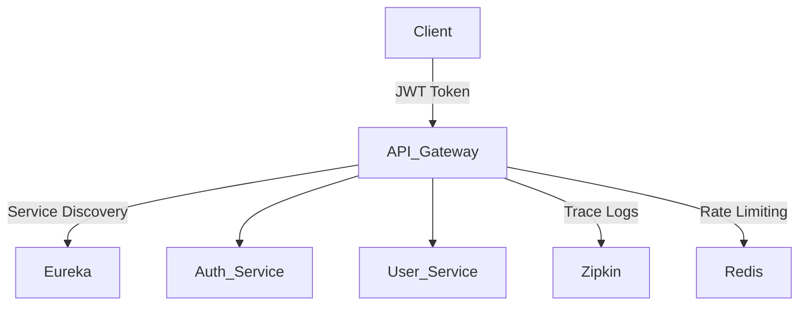

# 🧩 Microservices with Spring Boot

## 🔷 1. What Are Microservices?
Microservices is an architectural style where the application is composed of **independently deployable services**, each focusing on a **specific business capability**.

- Each service runs in its **own process**
- Has its own **database**
- Communicates via **lightweight protocols** (typically REST/HTTP or messaging like Kafka)

---

## 🔷 2. Key Features of Microservices
- **Loose coupling & high cohesion**
- **Independent deployment**
- **Technology polyglot** (different tech stacks possible per service)
- **Resilience & fault isolation**
- **Scalability** (scale services independently)

---

## 🔷 3. Why Spring Boot for Microservices?
- Rapid development with minimal configuration
- Embedded servers (Tomcat/Jetty)
- Seamless integration with Spring Cloud
- Auto-configuration & production-ready via Actuator
- Easy REST API + Database support

---

## 🔷 4. Essential Components in Spring Boot Microservices

| Component                  | Description                                                                 |
|---------------------------|-----------------------------------------------------------------------------|
| **Spring Boot App**       | Core microservice logic                                                     |
| **Spring Cloud Gateway**  | API Gateway for routing/filtering requests                                  |
| **Eureka Server**         | Service registry for discovery                                              |
| **Config Server**         | Centralized external configuration                                          |
| **Feign Client**          | Declarative REST client for inter-service communication                     |
| **Kafka / RabbitMQ**      | Asynchronous message broker                                                 |
| **Zipkin + Sleuth**       | Distributed tracing and correlation IDs                                     |
| **Resilience4j**          | Circuit breaker, retry, fallback                                            |
| **JWT + Spring Security** | Secure endpoints using tokens and roles                                     |

---

## 🔷 5. Inter-Service Communication

**Synchronous:**
- Using `RestTemplate` or `FeignClient`

**Asynchronous:**
- Using Kafka or RabbitMQ

```java
@FeignClient(name = "order-service")
public interface OrderClient {
   @GetMapping("/orders/user/{id}")
   List<Order> getOrdersByUser(@PathVariable Long id);
}

```
## 🔷 6. Best Practices

- Follow **Single Responsibility Principle** per service  
- Use **DTOs** to decouple internal models  
- Avoid direct database calls between services  
- Implement **centralized logging & tracing**  
- Secure APIs with **JWT/OAuth2**  
- Maintain **backward compatibility** in APIs  

---

## 🔷 7. Challenges in Microservices

- Complex inter-service communication  
- Distributed transactions → solved via **Saga Pattern**  
- Debugging → use **Sleuth + Zipkin**  
- Configuration management → use **Spring Cloud Config**  
- Data consistency → use **event-driven architecture**

---

## 🔷 8. Typical Spring Boot Microservices Project Structure

microservices/  
│  
├── api-gateway/ --> Spring Cloud Gateway  
├── config-server/ --> Centralized Configs  
├── discovery-server/ --> Eureka Service Registry  
├── user-service/ --> Sample Microservice (REST + JPA)  
├── order-service/ --> Another Microservice  
└── common-lib/ --> DTOs, Constants, Utils

---

## 🔷 9. Common Spring Annotations for Microservices

| Annotation               | Purpose                                  |
|--------------------------|------------------------------------------|
| `@SpringBootApplication` | Main class to bootstrap the app          |
| `@EnableEurekaClient`    | Register service with Eureka             |
| `@EnableFeignClients`    | Enables Feign client usage               |
| `@EnableDiscoveryClient` | Enables service discovery                |
| `@RestController`        | Marks a class as a REST controller       |

---

## 🔷 Difference Between Monolithic and Microservices

| Feature                   | Monolithic Architecture                                  | Microservices Architecture                                    |
|---------------------------|----------------------------------------------------------|---------------------------------------------------------------|
| **Definition**            | Single unified application                               | Application composed of small, independent services           |
| **Deployment**            | Entire application deployed as one unit                  | Each service is deployed independently                        |
| **Scalability**           | Scales by cloning the whole app                          | Individual services can be scaled independently               |
| **Technology Stack**      | Typically uses a single tech stack                       | Different services can use different tech stacks              |
| **Development**           | Easy to develop in early stages                          | Suitable for large, complex applications                      |
| **Codebase**              | One large codebase                                       | Multiple smaller codebases (per service)                      |
| **Communication**         | In-process method calls                                  | Lightweight protocols like HTTP/REST, Kafka, gRPC             |
| **Database**              | Single database                                          | Each service manages its own database                         |
| **Fault Isolation**       | A failure can bring down the whole app                   | Failure in one service doesn't affect others                  |
| **Deployment Time**       | Longer due to size of app                                | Faster as only changed services are deployed                  |
| **Testing**               | End-to-end testing is easier                             | Requires service-level and contract testing                   |
| **Team Ownership**        | Multiple teams work on the same codebase                 | Each team owns specific microservices                         |
| **Maintainability**       | Becomes harder as app grows                              | Easier to manage and maintain                                 |
| **Performance Overhead**  | Less (no inter-process communication)                    | Slightly higher due to inter-service communication            |

---

### ✅ Summary:

- **Monolithic**: Best for small, simple apps. Easy to start, harder to scale.  
- **Microservices**: Best for complex, scalable systems with independent teams.


## 🔷 Spring Boot and Microservices Architecture

### ✅ What is Spring Boot?

Spring Boot is a framework built on top of the Spring Framework that simplifies the development of production-ready applications.

**Key Features:**
- Auto-configuration
- Embedded servers (Tomcat, Jetty)
- Minimal XML configuration
- Actuator endpoints for monitoring
- Integration with Spring Cloud for microservices

---

### ✅ What is Microservices Architecture?

Microservices Architecture structures an application as a collection of small, loosely coupled, independently deployable services, each responsible for a specific business capability.

**Key Characteristics:**
- Decentralized data management (DB per service)
- Lightweight communication via REST or messaging (Kafka/RabbitMQ)
- Independent deployment
- Technology-agnostic services
- Fault isolation and high scalability

---

### ✅ Spring Boot + Microservices Architecture Overview

        

---

### ✅ Core Components in Spring Boot Microservices Architecture

| Component              | Description                                                                 |
|------------------------|-----------------------------------------------------------------------------|
| **Spring Boot**        | Base framework for developing REST-based services                           |
| **Spring Cloud Gateway** | API Gateway to route requests, apply filters, and security rules           |
| **Eureka Server**      | Service registry for service discovery                                      |
| **Spring Cloud Config**| Centralized external configuration management                               |
| **Feign Client**       | Declarative REST client for inter-service communication                     |
| **Kafka / RabbitMQ**   | Asynchronous messaging between services                                     |
| **Zipkin + Sleuth**    | Distributed tracing and request tracking                                    |
| **JWT + Spring Security** | Secure microservices using token-based authentication                    |

---

### ✅ Flow of Request in Microservices with Spring Boot

1. **Client** sends a request → hits **API Gateway**
2. **Gateway** routes request to appropriate **microservice**
3. **Microservice** handles logic, may call **other services** (via Feign/REST)
4. Services access their **own databases**
5. **Response** travels back to the client through the same path

---

### ✅ Benefits of Using Spring Boot for Microservices

- Fast development with minimal configuration
- Production-ready services with Actuator
- Easy integration with cloud-native components
- Wide community and documentation support
- Supports both synchronous (REST/Feign) and asynchronous (Kafka) communication


## 🔷 API Gateway in Microservices (Spring Cloud Gateway)

### ✅ What is an API Gateway?

An **API Gateway** is a server that acts as a **single entry point** for all client requests. It handles routing, authentication, rate limiting, logging, and response transformation before forwarding the request to backend services.

---

### ✅ Why Use API Gateway in Microservices?

- Simplifies client communication (only one endpoint to call)
- Centralized **authentication and authorization**
- Routes requests to appropriate microservices
- Can apply filters: **logging, retries, circuit breakers**
- Hides internal microservice structure from the client

---

### ✅ Spring Cloud Gateway (SCG)

Spring Cloud Gateway is the preferred **API Gateway** solution from Spring team, built on top of **Project Reactor** and **Spring WebFlux** for non-blocking I/O.

---

### ✅ Core Features of Spring Cloud Gateway

- **Routing**: Based on path, headers, query params, etc.
- **Filters**: Pre and post-processing of requests (e.g., auth, logging)
- **Rate limiting**: Control traffic load
- **Load balancing**: With Eureka or other discovery clients
- **Path rewriting**: Modify incoming URLs before forwarding

---

### ✅ Sample Route Configuration (application.yml)

```yaml
spring:
  cloud:
    gateway:
      routes:
        - id: user-service
          uri: lb://USER-SERVICE
          predicates:
            - Path=/users/**
        - id: order-service
          uri: lb://ORDER-SERVICE
          predicates:
            - Path=/orders/**
```

## 🔷 How API Gateway Works (In-Depth)

An API Gateway serves as the **front-door** to your microservices system. It intercepts all incoming client requests and processes them based on routing rules, filters, and policies.

---

### ✅ 1. Routing

**What it does:**  
Determines **which microservice** should handle a particular request based on routing rules.

**How it works:**
- **Path-based routing**  
  Example: `/users/**` → User Service  
  `/orders/**` → Order Service

- **Header-based routing**  
  Example: `X-Client-Version: v1` → Legacy Service

- **Query param-based routing**  
  Example: `/api/items?type=premium` → Premium Service

**Spring Cloud Gateway YAML Example:**

```yaml
spring:
  cloud:
    gateway:
      routes:
        - id: user-service
          uri: lb://USER-SERVICE
          predicates:
            - Path=/users/**
        - id: order-service
          uri: lb://ORDER-SERVICE
          predicates:
            - Path=/orders/**
```
### ✅ 2. Filtering (Pre & Post)

Filters allow you to **manipulate the request and response**. Filters can be used for logging, authentication, modification, etc.

-   **Pre-filters**: Run before request is routed  
    e.g., Authentication, Logging, Header Injection
    
-   **Post-filters**: Run after service responds  
    e.g., Response Transformation, Metrics Logging
    

**Example in Java:**
```java
@Component
public class CustomLoggingFilter implements GlobalFilter {
    @Override
    public Mono<Void> filter(ServerWebExchange exchange, GatewayFilterChain chain) {
        System.out.println(">>> Pre-Filter: Logging Request");
        return chain.filter(exchange).then(Mono.fromRunnable(() -> {
            System.out.println("<<< Post-Filter: Logging Response");
        }));
    }
}
```
### ✅ 3. Centralized Authentication and Authorization

API Gateway acts as the **security entry point** for all services.

-   Validates JWT/OAuth2 tokens
    
-   Forwards only **authorized requests**
    
-   Prevents exposing individual microservices to external users
    

**Benefits:**

-   Central point of control
    
-   Reduces duplicate auth logic across services

### ✅ 4. Rate Limiting

Prevents a single client or IP from **overloading** the backend system by limiting how many requests they can make in a given time frame.

**Use cases:**

-   Protects services from abuse
    
-   Ensures fair usage across clients
    
```yaml
spring:
  cloud:
    gateway:
      routes:
        - id: user-service
          uri: lb://USER-SERVICE
          predicates:
            - Path=/users/**
          filters:
            - name: RequestRateLimiter
              args:
                redis-rate-limiter.replenishRate: 10
                redis-rate-limiter.burstCapacity: 20
```
### ✅ 5. Load Balancing with Eureka

When integrated with **Eureka Service Discovery**, the API Gateway performs **client-side load balancing**.

-   Uses `lb://SERVICE-NAME` URI to discover available instances
    
-   Routes traffic to healthy instances only
    

**Built-in with Spring Cloud LoadBalancer or Ribbon**
### ✅ 6. Path Rewriting

Sometimes the internal microservice expects a different path than what the client sends.

**Use case:** Hide internal paths or version details

```yaml
filters:
  - RewritePath=/v1/api/(?<segment>.*), /$\{segment}
```
### ✅ 7. Hides Internal Microservice Details

The client:

-   **Only sees the Gateway** URL
    
-   Does **not know** how many services exist
    
-   Can be version-agnostic and simplified
    

Example:

-   Client calls `/api/products`
    
-   Gateway internally routes to `http://product-service/v1/products`


### ✅ 1. **What is API Gateway?**

API Gateway is the **central entry point** for all requests coming into your system. Instead of having clients directly call each microservice, the API Gateway routes and filters all requests and responses.

**Why use it?**

-   Hides internal service URLs
    
-   Adds centralized security (like JWT validation)
    
-   Applies rate limits
    
-   Handles failures with fallbacks
    
-   Performs logging, metrics collection, and response modification
### ✅ 2. **Routing Requests (Spring Cloud Gateway)**

Routing in Spring Cloud Gateway is configured using the `application.yml` file
routes:
  ```yaml
   - id: user-service
    uri: lb://USER-SERVICE
    predicates:
      - Path=/users/**
```
This means:

-   Any request like `/users/1` is **routed to `USER-SERVICE`**.
    
-   `lb://` means it uses **load balancing** via Eureka to pick a healthy instance.
    

You can route based on:

-   URL paths (`/users/**`)
    
-   HTTP headers (`X-Version: 1`)
    
-   Query parameters (`?type=premium`)
### ✅ 3. **JWT Authentication Filter**

The `JwtAuthFilter` is a **custom security filter** applied on incoming requests before routing them.

What it does:

-   Checks if the `Authorization` header contains a token (starting with `Bearer` )
    
-   Rejects the request if no token is present
    
-   In a real-world app, it would decode the token and check if it’s valid (expired or tampered)
    

**Purpose:** To **secure all microservices** through a single filter in the gateway.
### ✅ 4. **Fallback Mechanism**

If a microservice is **down or unresponsive**, the API Gateway uses a **fallback URI** to return a predefined message.

Example:
```yaml
filters:
  - name: CircuitBreaker
    args:
      name: userServiceCB
      fallbackUri: forward:/userServiceFallback

```
This redirects the request to `/userServiceFallback` (a controller method) when the service fails.

**Why it's important:** Prevents total system failure and gives a graceful response.
### ✅ 5. **Service Discovery (Eureka)**

Eureka acts as the **service registry**.

-   Each microservice (user, order, auth) **registers itself** with Eureka.
    
-   The API Gateway and other services use Eureka to **discover instances** dynamically.
    
-   No hardcoding of IPs or ports is needed.
    

**Example in YAML:**
```yaml
eureka:
  client:
    service-url:
      defaultZone: http://localhost:8761/eureka/
```
### ✅ 6. **Dummy JWT Generation (Auth Service)**

The `auth-service` acts like an **identity provider**. It returns a dummy token (in reality, you’d generate a signed JWT with user claims).
```json
POST /auth/login
{
  "username": "subba",
  "password": "reddy"
}
```
Response:
```
Bearer dummy-jwt-token
```
**Purpose:** Simulates real login + token generation flow.
### ✅ 7. **User & Order Microservices**

These services are protected via gateway:

-   `GET /users/1` → Routed to `user-service`
    
-   `GET /orders/1` → Routed to `order-service`
    

They are simple REST endpoints that demonstrate how each service:

-   Has **its own controller**
    
-   Runs **on a separate port**
    
-   Is **registered with Eureka**
    

----------

### ✅ 8. **Final Flow (End-to-End)**
```
Client
   │
   │ 1. Sends Request with JWT → /users/1
   ▼
API Gateway
   │
   ├── Validates JWT
   ├── Logs Request
   ├── Applies Rate Limits (optional)
   ├── Routes to user-service via Eureka
   ▼
User Service
   │
   └── Returns response
   ▲
   Gateway filters post-process
   │
   ▼
Response sent back to client
```
## 🔷 Spring Boot API Gateway with Microservices - Documentation

This documentation explains the implementation of a full-fledged API Gateway using **Spring Cloud Gateway** integrated with **JWT authentication**, **service discovery (Eureka)**, and **fallback handling**.

---

### ✅ Project Structure

```
microservices/
├── api-gateway/           --> API Gateway with JWT filter & fallback
├── auth-service/          --> Issues JWT token (dummy for demo)
├── user-service/          --> Sample protected microservice
├── order-service/         --> Another microservice
└── discovery-server/      --> Eureka Service Registry
```

---

### ✅ 1. API Gateway Setup

**Main Class:** `ApiGatewayApplication.java`
```java
@SpringBootApplication
@EnableDiscoveryClient
public class ApiGatewayApplication {
    public static void main(String[] args) {
        SpringApplication.run(ApiGatewayApplication.class, args);
    }
}
```

**application.yml**
```yaml
server:
  port: 8080

spring:
  application:
    name: api-gateway
  cloud:
    gateway:
      discovery:
        locator:
          enabled: true
          lower-case-service-id: true
      routes:
        - id: user-service
          uri: lb://USER-SERVICE
          predicates:
            - Path=/users/**
          filters:
            - name: JwtAuthFilter
            - name: CircuitBreaker
              args:
                name: userServiceCB
                fallbackUri: forward:/userServiceFallback

eureka:
  client:
    service-url:
      defaultZone: http://localhost:8761/eureka/
```

---

### ✅ 2. Custom JWT Filter

**JwtAuthFilter.java**
```java
@Component
public class JwtAuthFilter extends AbstractGatewayFilterFactory<JwtAuthFilter.Config> {

    public JwtAuthFilter() {
        super(Config.class);
    }

    @Override
    public GatewayFilter apply(Config config) {
        return (exchange, chain) -> {
            String authHeader = exchange.getRequest().getHeaders().getFirst(HttpHeaders.AUTHORIZATION);
            if (authHeader == null || !authHeader.startsWith("Bearer ")) {
                exchange.getResponse().setStatusCode(HttpStatus.UNAUTHORIZED);
                return exchange.getResponse().setComplete();
            }
            // Here, you can validate JWT token
            return chain.filter(exchange);
        };
    }

    public static class Config {}
}
```

---

### ✅ 3. Fallback Handling

**FallbackController.java**
```java
@RestController
public class FallbackController {

    @GetMapping("/userServiceFallback")
    public ResponseEntity<String> userFallback() {
        return ResponseEntity.status(503).body("User Service is unavailable. Try again later.");
    }
}
```

---

### ✅ 4. Discovery Server (Eureka)

**DiscoveryServerApplication.java**
```java
@SpringBootApplication
@EnableEurekaServer
public class DiscoveryServerApplication {
    public static void main(String[] args) {
        SpringApplication.run(DiscoveryServerApplication.class, args);
    }
}
```

**application.yml**
```yaml
server:
  port: 8761
spring:
  application:
    name: discovery-server

eureka:
  client:
    register-with-eureka: false
    fetch-registry: false
  server:
    enable-self-preservation: false
```

---

### ✅ 5. Auth Service (Dummy JWT)

**AuthController.java**
```java
@RestController
@RequestMapping("/auth")
public class AuthController {

    @PostMapping("/login")
    public ResponseEntity<String> login(@RequestBody User user) {
        // In real life, validate user and generate JWT
        return ResponseEntity.ok("Bearer dummy-jwt-token");
    }

    static class User {
        public String username;
        public String password;
    }
}
```

**application.yml**
```yaml
server:
  port: 8081
spring:
  application:
    name: auth-service

eureka:
  client:
    service-url:
      defaultZone: http://localhost:8761/eureka/
```

---

### ✅ 6. User & Order Services

**UserController.java**
```java
@RestController
@RequestMapping("/users")
public class UserController {
    @GetMapping("/{id}")
    public String getUser(@PathVariable String id) {
        return "User with ID: " + id;
    }
}
```

**OrderController.java**
```java
@RestController
@RequestMapping("/orders")
public class OrderController {
    @GetMapping("/{id}")
    public String getOrder(@PathVariable String id) {
        return "Order with ID: " + id;
    }
}
```

**application.yml (both)**
```yaml
server:
  port: 808X  # 8082 for user, 8083 for order
spring:
  application:
    name: user-service / order-service

eureka:
  client:
    service-url:
      defaultZone: http://localhost:8761/eureka/
```

---

### 🧠 Explanation of Key Concepts

**What is API Gateway?**
- Central entry point to all microservices
- Handles security, routing, load balancing, and fallbacks

**Routing:**
- Defined using path predicates in `application.yml`
- Load-balanced to healthy service instances via Eureka

**JWT Filter:**
- Validates authorization tokens on each request
- Prevents unauthorized access before reaching microservices

**Fallbacks:**
- Circuit breakers detect failure
- Custom fallback methods give user-friendly error responses

**Service Discovery (Eureka):**
- Dynamically registers and locates microservices
- Removes hardcoded IPs and ports

**Auth Service:**
- Issues a dummy JWT token on login
- In production, this will include user claims and signature

**Microservices:**
- Small services like user-service and order-service expose REST APIs
- They register with Eureka and are routed through API Gateway

**End-to-End Flow:**
1. Client sends request with JWT → API Gateway
2. JWT validated → Route to service → Fallback if down
3. Response sent back to client

---

✅ This is  complete API Gateway + Eureka + JWT + Fallback base project.


### ✅ 1. **Add Rate Limiting (Redis-backed)**

**Why:** Prevent abuse, control traffic per client or API.

**How:**

-   Use `RequestRateLimiter` filter in Spring Cloud Gateway
    
-   Backed by Redis (stores request counts per key)
    

**Includes:**

-   Redis setup
    
-   `application.yml` update
    
-   Rate limiting filter example
    

----------

### ✅ 2. **Write Real JWT Verification Logic**

**Why:** Validate real tokens, ensure secure communication.

**How:**

-   Add JWT secret key in config
    
-   Decode and validate JWT (issuer, signature, expiry, roles)
    
-   Add helper methods for claims extraction
    

**Includes:**

-   JWT utility class
    
-   Updated `JwtAuthFilter` to validate and parse tokens
    
-   Use libraries like `io.jsonwebtoken` (JJWT)
    

----------

### ✅ 3. **Create Docker Compose Setup**

**Why:** Easily run all services with one command (`docker-compose up`)

**How:**

-   Dockerfiles for each service
    
-   `docker-compose.yml` to spin up all containers (gateway, Eureka, auth, user, order, redis)
    

**Includes:**

-   Base images
    
-   Network setup
    
-   Redis and Eureka containers
    

----------

### ✅ 4. **Generate Postman Collection**

**Why:** Quickly test login, API calls with token, fallback

**How:**

-   `POST /auth/login` → get token
    
-   Use token in `Authorization` header
    
-   Test `/users/{id}`, `/orders/{id}`, and fallback
    

**Includes:**

-   `.json` file (import into Postman)
    
-   Environments and pre-request scripts

🔷 Topics to Learn in Spring Cloud API Gateway
🔢

Topic

Why It's Important

## 🚀 Spring Cloud Gateway – Core Features to Master

| 🔢 No. | 🔧 Feature                                 | 📘 Description                                                                 |
|-------|---------------------------------------------|--------------------------------------------------------------------------------|
| 1️⃣    | **Routing with Predicates**                | Route based on path, headers, method, query params, etc.                      |
| 2️⃣    | **Filters (Pre/Post)**                     | Modify request/response — auth, logging, headers, etc.                        |
| 3️⃣    | **JWT Authentication**                     | Secure services by validating JWT tokens at the gateway level                 |
| 4️⃣    | **Rate Limiting (Redis)**                  | Limit API usage per IP/user/token using Redis-backed rate limiting            |
| 5️⃣    | **Circuit Breakers (Resilience4j)**        | Graceful fallback when microservices fail or time out                         |
| 6️⃣    | **Centralized Logging & Tracing**          | Track requests using **Sleuth + Zipkin**                                      |
| 7️⃣    | **Load Balancing with Eureka**             | Auto-routing to healthy service instances (client-side load balancing)        |
| 8️⃣    | **Path Rewriting / Header Manipulation**   | Rewrite URLs or inject headers before forwarding                              |
| 9️⃣    | **Custom Filters**                         | Add custom logic (e.g., auth, logging, request mutation)                      |
| 🔟    | **Swagger Aggregation (OpenAPI)**           | Show multiple microservices' APIs in a single Swagger UI                      |
| 1️⃣1️⃣  | **Request Logging Filters**                | Log request details, mask sensitive data, capture audit trails                |
| 1️⃣2️⃣  | **CORS (Cross-Origin Resource Sharing)**   | Allow or restrict frontend domains to access backend APIs                     |


🚀 BONUS: Enterprise-Level Enhancements
### ✅ Suggested Learning Path

1.  ✅ **Start with basics**: routing, filters, Eureka, JWT
    
2.  🚀 Add **rate limiting**, **circuit breaker**, **fallbacks**
    
3.  🧪 Integrate **tracing, Swagger aggregation**, and **monitoring tools**
    
4.  🐳 Dockerize and deploy all components
    
5.  📈 Add observability, testing tools, and real CI/CD workflows

## 🔷 Scenario-Based API Gateway Interview Questions (for 3 Yrs Experience)

----------

### ✅ 1. **JWT Validation at Gateway**

**🧩 Scenario:**  
You implemented JWT in your microservices. The client sends a request without a valid token.  
**How will your API Gateway detect this, and what should happen?**

**What to Explain:**

-   Use a **custom filter** (`GatewayFilter`) to intercept and validate JWT.
    
-   Return `401 Unauthorized` if token is missing or invalid.
    
-   Only forward valid requests to microservices.
    

----------

### ✅ 2. **Service Is Down (Circuit Breaker + Fallback)**

**🧩 Scenario:**  
`order-service` is down. A client makes a request to `/orders/123`.  
**How does your gateway handle this gracefully without crashing the client?**

**Expected Concepts:**

-   Use Spring Cloud Gateway’s **CircuitBreaker filter** (with Resilience4j or Hystrix).
    
-   Configure a **`fallbackUri`** to return a friendly response (e.g., “Order service is temporarily unavailable”).
    

----------

### ✅ 3. **Rate Limiting a Client**

**🧩 Scenario:**  
One client floods your API with requests. You want to limit it to 5 requests per second.  
**How do you implement this?**

**Key Points:**

-   Use `RequestRateLimiter` filter in gateway.
    
-   Back it with **Redis** (token bucket algorithm).
    
-   Use **KeyResolver** (e.g., based on IP address or user ID).
    

----------

### ✅ 4. **Routing Dynamically Without Hardcoding URLs**

**🧩 Scenario:**  
You have 10 microservices. You don’t want to hardcode each service’s URL in the gateway config.  
**How will you configure routing?**

**Answer:**

-   Enable **Eureka service discovery**.
    
-   Use `spring.cloud.gateway.discovery.locator.enabled=true` → this auto-generates routes using `lb://`.
    

----------

### ✅ 5. **Different Response Based on Route or Version**

**🧩 Scenario:**  
Your frontend hits `/v1/users/123` and `/v2/users/123`. You want to send traffic to two different services.  
**How do you set this up in gateway?**

**What to Explain:**

-   Use **path-based routing** with different service URIs:
    


`predicates:  -  Path=/v1/users/**  →  user-service-v1  -  Path=/v2/users/**  →  user-service-v2` 

----------

### ✅ 6. **Modify or Rewrite Path in Gateway**

**🧩 Scenario:**  
Frontend calls `/api/users/123`, but the backend expects `/users/123`.  
**How do you fix this without changing the frontend?**

**Explain:**

-   Use `RewritePath` filter:
    

`filters:  -  RewritePath=/api/(?<segment>.*),  /$\u003csegment>` 

----------

### ✅ 7. **Logging All Incoming Requests**

**🧩 Scenario:**  
Your team wants to log all requests coming into the gateway, including headers and IP.  
**How would you implement this?**

**Best Approach:**

-   Implement a **`GlobalFilter`** that logs request info before routing.
    
-   Can also add MDC for tracing across services.
    

----------

### ✅ 8. **Different Auth for Different Services**

**🧩 Scenario:**  
Some services require JWT, others don’t. How would you handle that in Gateway?

**Answer:**

-   Use conditional filters:
    
    -   Apply `JwtAuthFilter` only to certain routes.
        
    -   Or add `FilterChain` logic that checks route ID before applying security logic.
        

----------

### ✅ 9. **Return Custom Error When Rate Limit Exceeded**

**🧩 Scenario:**  
You want to show a custom JSON response when a client exceeds rate limit.  
**Can Spring Gateway do this?**

**Answer:**

-   Not directly out of the box — you'd need:
    
    -   A custom **`RateLimiter` implementation** OR
        
    -   Handle response in a custom global error handler.
        

----------

### ✅ 10. **Expose Only Gateway to External World**

**🧩 Scenario:**  
You accidentally exposed a microservice on a public port. What security risks arise, and how do you prevent this?

**Key Points:**

-   Clients can bypass Gateway (JWT, rate limiting, fallback all skipped).
    
-   Always expose **only Gateway to the internet**.
    
-   Keep services behind firewall/internal network.
    

----------

## 🧠 Bonus Conceptual Questions

| 🔢 Question                                                  | 💡 What to Cover                                                        |
|-------------------------------------------------------------|-------------------------------------------------------------------------|
| What is the difference between Pre and Post filters?        | Pre = before routing (auth, log), Post = after response (metrics, headers) |
| How do you trace requests end-to-end?                       | Use **Spring Cloud Sleuth** for trace IDs + **Zipkin** for visual traces |
| How to use API Gateway to aggregate Swagger from services?  | Use **Swagger UI Aggregation** via path rewrites or Swagger Gateway plugin |


# 🚀 Spring Cloud Microservices Architecture

A **production-ready microservices setup** built with Spring Boot, Spring Cloud Gateway, Eureka, JWT authentication, Redis-backed rate limiting, and Docker Compose.

---

## 🧱 Architecture Overview


📁 Project Structure
```microservices-architecture/
│
├── api-gateway/           # Spring Cloud Gateway with filters, routing, JWT, rate limiting
├── discovery-server/      # Eureka service registry
├── auth-service/          # Issues JWT tokens
├── user-service/          # Secured microservice
├── redis/                 # Redis container (rate limiter backend)
├── zipkin/                # Distributed tracing service
└── docker-compose.yml     # Brings everything together
```
## ✨ Features

-   ✅ **Spring Cloud Gateway** (Routing, Filters, Path Rewriting)
    
-   🔐 **JWT Authentication** via custom filter
    
-   ⛔ **Rate Limiting** using Redis
    
-   ♻️ **Circuit Breaker + Fallbacks** with Resilience4j
    
-   🔁 **Service Discovery** with Eureka
    
-   📜 **Centralized Logging & Tracing** using Sleuth + Zipkin
    
-   🔧 **Custom Filters** (Auth, Logging)
    
-   🚦 **Swagger Aggregation** (Optional enhancement)
    
-   🐳 **Dockerized Stack** — run with one command!

🚀 How to Run (Docker Compose)
```
# Clone the repo
git clone https://github.com/your-username/microservices-architecture.git
cd microservices-architecture

# Build and start all services
docker-compose build
docker-compose up
```
## 🔐 JWT Authentication Flow

1.  `POST /auth/login`  
    👉 Receives `{ username, password }`, returns JWT token.
    
2.  `GET /users/1`  
    👉 Add `Authorization: Bearer <token>` in header to access user-service.
    

----------

## 🧪 Test with Postman

### 1️⃣ Login

```json
POST http://localhost:8080/auth/login
Body: { "username": "subba", "password": "1234" }
```
### 2️⃣ Access user service

```json
GET http://localhost:8080/users/1

Headers: Authorization: Bearer <your_token>`
```
## 🔧 Configuration Highlights

### `application.yml` (Gateway)
```yaml
spring:
  cloud:
    gateway:
      routes:
        - id: user-service
          uri: lb://user-service
          predicates:
            - Path=/users/**
          filters:
            - JwtAuthFilter
            - name: RequestRateLimiter
              args:
                redis-rate-limiter.replenishRate: 5
                redis-rate-limiter.burstCapacity: 10
            - name: CircuitBreaker
              args:
                name: userCB
                fallbackUri: forward:/fallback/users
```
## 📊 Monitoring & Tracing

-   View tracing: `http://localhost:9411` (Zipkin)
    
-   Eureka Dashboard: `http://localhost:8761`

## 🛠 Future Enhancements

-   🔑 OAuth2 + Keycloak integration
    
-   🧪 Swagger UI aggregation
    
-   📈 Prometheus + Grafana metrics
    
-   🔐 Role-based access per route

## 🧠 Spring Cloud API Gateway – Interview Questions (3 YOE)

| #  | ❓ Question                                                                 | ✅ What to Cover                                                                 |
|----|------------------------------------------------------------------------------|----------------------------------------------------------------------------------|
| 1  | What is Spring Cloud Gateway?                                               | A lightweight reactive API gateway using Spring WebFlux                         |
| 2  | How is it different from Zuul?                                              | WebFlux-based (non-blocking), better performance, newer design                  |
| 3  | What is a Route Predicate?                                                  | Condition to match incoming requests (Path, Method, Header, Query Param, etc.) |
| 4  | What are Pre and Post filters?                                              | Pre: before routing (auth, logging), Post: after routing (metrics, headers)     |
| 5  | What is the purpose of a Gateway Filter?                                    | Modify requests/responses, perform checks, logging, metrics                     |
| 6  | How do you implement JWT authentication in Gateway?                         | Custom `GatewayFilterFactory`, validate token, forward only if valid            |
| 7  | How do you pass user info to downstream services?                          | Extract from JWT, inject into headers before forwarding                         |
| 8  | How to apply security only to specific routes?                              | Apply filter conditionally per route                                            |
| 9  | How does rate limiting work?                                                | Redis-based token bucket algorithm using `RequestRateLimiter` filter            |
| 10 | How to customize rate limit per user?                                       | Create a `KeyResolver` based on IP/token/user ID                                |
| 11 | How to handle fallback for failed services?                                 | Use Circuit Breaker filter with `fallbackUri`                                   |
| 12 | What is used for circuit breaker in Spring Cloud Gateway?                  | Resilience4j (or Hystrix optionally)                                            |
| 13 | How do you rewrite the path in Gateway?                                     | Use `RewritePath` filter with RegEx mapping                                     |
| 14 | How to inject custom headers in a request?                                  | Mutate headers using `ServerHttpRequest.mutate()` in filter                     |
| 15 | How to implement global logging for all requests?                           | Create and register a `GlobalFilter`                                            |
| 16 | How does load balancing work?                                               | Via `lb://` URI using Eureka service discovery                                  |
| 17 | How do you trace requests across services?                                  | Sleuth adds `traceId`, `spanId`; Zipkin visualizes the trace                    |
| 18 | How do you Dockerize Spring Cloud Gateway?                                  | Dockerfile per service + Docker Compose with Redis, Eureka, Zipkin, etc.        |
| 19 | How do you expose Swagger UI for multiple services?                         | Use path rewrite in gateway or Swagger UI aggregation                           |
| 20 | How do you secure gateway endpoints in production?                          | Use HTTPS, JWT filters, IP whitelisting, CORS rules                             |


## 🔷 Service Registry & Service Discovery

### ✅ What Is Service Discovery?

In microservices, services often **start, stop, scale dynamically** across different machines.  
Service Discovery allows services to **find and communicate** with each other **without hardcoding IPs or URLs**.

---

### ✅ What Is a Service Registry?

A **Service Registry** is a central directory that **tracks available services** and their **host/port metadata**.  
It allows automatic **registration and lookup** of microservices at runtime.

---

### 🏢 Real-World Analogy

> Think of the **Service Registry** as a hotel reception:
> - Services are like guests registering when they check in (register with Eureka)
> - Other guests can ask the receptionist for someone's room number (service lookup)
> - The receptionist keeps track of who is available and where

---

### 🛠 How It Works

| Role              | Function                                                                 |
|-------------------|--------------------------------------------------------------------------|
| **Service Registry** | Maintains a dynamic list of service instances (e.g., Eureka server)      |
| **Service Provider** | Registers itself to the registry on startup (e.g., user-service)        |
| **Service Consumer** | Looks up services from registry to invoke (e.g., API Gateway)           |

---

### 🔧 Technologies

| Tool         | Role                   |
|--------------|------------------------|
| **Eureka Server** | Service Registry (Netflix OSS) |
| **Eureka Client** | Spring Boot microservices          |
| **Consul / Zookeeper** | Alternative service registries |

---

### 📦 Spring Cloud + Eureka Example

#### ✅ Eureka Server (`discovery-server`)

```yaml
# application.yml
server:
  port: 8761

eureka:
  client:
    register-with-eureka: false
    fetch-registry: false
```
```java
@EnableEurekaServer
@SpringBootApplication
public class DiscoveryServerApplication {
    public static void main(String[] args) {
        SpringApplication.run(DiscoveryServerApplication.class, args);
    }
}

```
#### ✅ Eureka Client (`user-service`, `api-gateway`)

```yaml
spring:
  application:
    name: user-service

eureka:
  client:
    service-url:
      defaultZone: http://localhost:8761/eureka
 
```
```java
@EnableEurekaClient
@SpringBootApplication
public class UserServiceApplication {
    public static void main(String[] args) {
        SpringApplication.run(UserServiceApplication.class, args);
    }
}

```
----------

### 🔁 How It Works Together

1.  `discovery-server` starts as Eureka Server
    
2.  `user-service` and `api-gateway` **register** themselves on startup
    
3.  Gateway uses `lb://user-service` to **discover** and forward requests
    

----------

### 📈 Benefits

-   ✅ No hardcoding of IPs or hostnames
    
-   🔄 Supports auto-scaling & dynamic environments
    
-   💥 Enables load balancing (Ribbon/Resilience4j)
    
-   🔌 Easily integrated with Spring Cloud Gateway, Feign Clients
    

----------

### 🚫 Without Service Discovery

❌ Static URLs → brittle  
❌ Manual config updates  
❌ No load balancing or failover

----------

Here's a complete **implementation code setup** for **Service Registry (Eureka Server)** and a **Service Provider (Eureka Client)** using Spring Boot. You can copy this into your documentation or project.
## ✅ 1. Eureka Server (Service Registry)

### 🔧 `pom.xml` dependencies

```
<dependencies>
    <dependency>
        <groupId>org.springframework.cloud</groupId>
        <artifactId>spring-cloud-starter-netflix-eureka-server</artifactId>
    </dependency>
</dependencies>

```

### ⚙️ application.yml
```yaml
server:
  port: 8761

spring:
  application:
    name: discovery-server

eureka:
  client:
    register-with-eureka: false
    fetch-registry: false
```
### 🚀 Main Class
```java
@SpringBootApplication
@EnableEurekaServer
public class DiscoveryServerApplication {
    public static void main(String[] args) {
        SpringApplication.run(DiscoveryServerApplication.class, args);
    }
}
```
## ✅ 2. Eureka Client (User-Service Example)

### 🔧 `pom.xml` dependencies
```
<dependencies>
    <dependency>
        <groupId>org.springframework.cloud</groupId>
        <artifactId>spring-cloud-starter-netflix-eureka-client</artifactId>
    </dependency>
    <dependency>
        <groupId>org.springframework.boot</groupId>
        <artifactId>spring-boot-starter-web</artifactId>
    </dependency>
</dependencies>
```
⚙️ `application.yml`
```yaml
server:
  port: 8081

spring:
  application:
    name: user-service

eureka:
  client:
    service-url:
      defaultZone: http://localhost:8761/eureka
```
🚀 Main Class
```java
@SpringBootApplication
@EnableEurekaClient
public class UserServiceApplication {
    public static void main(String[] args) {
        SpringApplication.run(UserServiceApplication.class, args);
    }
}
```
✅ Sample Controller
```java
@RestController
@RequestMapping("/users")
public class UserController {

    @GetMapping("/{id}")
    public ResponseEntity<String> getUser(@PathVariable String id) {
        return ResponseEntity.ok("User ID: " + id);
    }
}
```
## 🐳 Docker Compose (Optional)

You can deploy both services using Docker Compose:

### 📦 `docker-compose.yml`
```yaml
version: '3.8'

services:
  discovery-server:
    build: ./discovery-server
    ports:
      - "8761:8761"

  user-service:
    build: ./user-service
    ports:
      - "8081:8081"
    depends_on:
      - discovery-server
```
## ✅ Test It

1.  Run `discovery-server` → Visit `http://localhost:8761`
    
2.  Start `user-service` → It auto-registers in the Eureka dashboard
    
3.  Call: `http://localhost:8081/users/1`


## 📚 Interview & Scenario-Based Questions: Service Registry & Discovery (Eureka)

| #  | ❓ Question                                                                  | ✅ What to Cover                                                                 |
|----|------------------------------------------------------------------------------|----------------------------------------------------------------------------------|
| 1  | What is a Service Registry?                                                 | A central server where microservices register themselves for discovery          |
| 2  | What is Service Discovery?                                                  | Mechanism for services to discover each other dynamically                       |
| 3  | How does Eureka work in Spring Cloud?                                       | Services register with Eureka and query it to find other services               |
| 4  | What is the difference between Eureka Server and Eureka Client?            | Server: registry, Client: registers and discovers                               |
| 5  | What are the key configurations in `application.yml` for Eureka?           | `defaultZone`, `fetchRegistry`, `registerWithEureka`                            |
| 6  | What happens when Eureka server goes down?                                 | Discovery fails; circuit breakers or retries should be in place                 |
| 7  | Can multiple Eureka servers be run in production?                          | Yes — run in cluster for high availability (HA)                                 |
| 8  | What is the default heartbeat interval in Eureka?                          | Every 30 seconds (by default); can be customized                                |
| 9  | How to handle stale instances in Eureka?                                   | Set `evictionIntervalTimerInMs`, enable self-preservation mode                  |
| 10 | How does API Gateway use Eureka for discovery?                             | Uses `lb://<service-name>` and discovers via Eureka                             |
| 11 | How to load balance across instances discovered via Eureka?                | Spring Cloud LoadBalancer or Ribbon (deprecated)                                |
| 12 | How to register only specific services with Eureka?                        | Use `@EnableEurekaClient` only in desired services                              |
| 13 | How to secure Eureka dashboard or registry?                                | Use Spring Security (basic auth or OAuth2)                                      |
| 14 | How to disable Eureka registration in local or test profiles?              | Set `register-with-eureka: false`                                               |
| 15 | What are Eureka alternatives?                                               | Consul, Zookeeper, Nacos                                                        |
| 16 | What happens when a registered instance crashes?                           | Eureka removes it after timeout (default ~90 sec unless heartbeat is missed)   |
| 17 | How does Eureka achieve fault tolerance?                                   | Self-preservation mode, replicas in HA mode                                     |
| 18 | How do you monitor registered services in Eureka?                          | Via Eureka dashboard or Spring Boot Actuator endpoints                          |
| 19 | How to prevent stale data in Eureka registry?                              | Disable self-preservation + shorten eviction timeout                            |
| 20 | How would you scale service discovery in a large system?                   | Use Eureka clusters + API Gateway + global registry pattern                     |

## ✅ Example Scenario-Based Questions with Answers

> 🧩 **Scenario 1:**  
> **Q:** Your microservice is not discoverable by other services. What could be wrong?  
> **A:** Check if the service is registering with Eureka (`register-with-eureka: true`), ensure Eureka client dependencies are present, and validate the Eureka server URL.

> 🧩 **Scenario 2:**  
> **Q:** After scaling up a service, some instances are not hit. Why?  
> **A:** Eureka may not have updated all service instances yet, or your load balancer is caching stale instances. Consider lowering Eureka cache TTL.

> 🧩 **Scenario 3:**  
> **Q:** Eureka dashboard shows stale/down services even after stopping them. What to do?  
> **A:** Reduce `evictionIntervalTimerInMs` and disable `self-preservation-mode` in Eureka server to remove stale services faster.

> 🧩 **Scenario 4:**  
> **Q:** You want your service to discover another service **only if Eureka is available**. How?  
> **A:** Use Spring Retry, fail-safe fallback logic, or define a circuit breaker around Feign/Gateway.


## 🔷 API Gateway Integration with Eureka Server


### 📘 Overview

Spring Cloud Gateway integrates seamlessly with Eureka for **dynamic routing** to registered microservices.  
With Eureka, the Gateway does **not need hardcoded URLs** — it discovers service instances automatically.

---

### 🧩 Architecture

1. Microservices (user-service, order-service) **register** with Eureka
2. API Gateway also registers with Eureka
3. Gateway routes requests using service names like `lb://user-service`
4. Eureka returns healthy instances to the Gateway
5. Gateway applies filters and forwards the request

---

### ⚙️ `pom.xml` for API Gateway
```xml
<dependencies>
  <dependency>
    <groupId>org.springframework.cloud</groupId>
    <artifactId>spring-cloud-starter-gateway</artifactId>
  </dependency>
  <dependency>
    <groupId>org.springframework.cloud</groupId>
    <artifactId>spring-cloud-starter-netflix-eureka-client</artifactId>
  </dependency>
</dependencies>
```
### ⚙️ `application.yml` (API Gateway)

```yaml
server:
  port: 8080

spring:
  application:
    name: api-gateway

eureka:
  client:
    service-url:
      defaultZone: http://localhost:8761/eureka

spring:
  cloud:
    gateway:
      discovery:
        locator:
          enabled: true
          lower-case-service-id: true
      routes:
        - id: user-service
          uri: lb://user-service
          predicates:
            - Path=/users/**

        - id: order-service
          uri: lb://order-service
          predicates:
            - Path=/orders/**

``` 

----------

### 🚀 `ApiGatewayApplication.java`
```java
@SpringBootApplication
@EnableEurekaClient
public class ApiGatewayApplication {
    public static void main(String[] args) {
        SpringApplication.run(ApiGatewayApplication.class, args);
    }
}

```
----------

### ✅ How It Works
| Feature                   | Behavior                                                                 |
|---------------------------|--------------------------------------------------------------------------|
| `uri: lb://user-service`  | Gateway dynamically discovers `user-service` via Eureka                 |
| `Path=/users/**`          | Routes all requests matching `/users/**` to `user-service`              |
| `@EnableEurekaClient`     | Registers the API Gateway with Eureka for service discovery             |


Makes Gateway discoverable and able to use service registry
----------

### 📈 Benefits

-   ✅ No need to hardcode service URLs
    
-   ✅ Built-in load balancing
    
-   ✅ Scalable routing config
    
-   ✅ Resilient to instance failures
    
-   ✅ Simplifies microservice communication
    

----------

### 🧪 Test it

-   Start **Eureka Server**
    
-   Start **user-service** and **order-service**
    
-   Start **api-gateway**
    
-   Access via:
    
    -   `http://localhost:8080/users/1`
        
    -   `http://localhost:8080/orders/100`
        

----------

### 🛠 Pro Tips

-   Use `Spring Cloud LoadBalancer` for custom load balancing
    
-   Combine with JWT filter to secure routes
    
-   Add **circuit breaker + fallback** for better resilience
    
-   Use `RewritePath` for cleaner URLs

## 🔷 Microservices Communication

In a microservices architecture, services must **communicate** with each other to fulfill business workflows. There are two primary communication types:

---

### 🔁 1. Synchronous Communication

> Real-time request-response (Blocking)

#### ✅ Protocols
- **HTTP/REST**
- **gRPC**
- **Feign Client**
- **GraphQL**

#### ✅ Characteristics
| Feature             | Description                                |
|---------------------|--------------------------------------------|
| Latency             | Depends on network; slower under load      |
| Coupling            | Tighter (consumer waits for response)      |
| Use Case            | CRUD ops, user-facing requests             |
| Examples            | `RestTemplate`, `WebClient`, `FeignClient` |

#### ✅ Pros
- Simple to implement and debug
- Easier error handling (HTTP codes)
- Works well for request-response models

#### ❌ Cons
- Tightly coupled (fails if service is down)
- Not ideal for high throughput/low latency needs

---

### 📬 2. Asynchronous Communication

> Event-driven (Non-blocking)

#### ✅ Protocols & Tools
- **Kafka**
- **RabbitMQ**
- **ActiveMQ**
- **AWS SNS/SQS**

#### ✅ Characteristics
| Feature             | Description                                 |
|---------------------|---------------------------------------------|
| Latency             | Decoupled and often faster at scale         |
| Coupling            | Loosely coupled                             |
| Use Case            | Notifications, audit logs, batch processing |
| Examples            | Kafka consumers/producers, message queues   |

#### ✅ Pros
- Decouples producer and consumer
- More resilient and scalable
- Supports retries and message durability

#### ❌ Cons
- Harder to debug
- Requires message brokers
- Eventual consistency required

---

### 🏁 When to Use What?

| Scenario                                  | Recommended Approach     |
|-------------------------------------------|---------------------------|
| Real-time API request (e.g., get user)    | Synchronous (REST, Feign) |
| Order placed → trigger email              | Asynchronous (Kafka)      |
| Update one service and notify others      | Asynchronous (Events)     |
| Chained workflow (needs data immediately) | Synchronous               |

---

### ⚙️ Best Practices

- Use **DTOs** for inter-service contracts
- Implement **Circuit Breakers** in sync calls
- Use **Idempotency** for retries in async events
- Design for **eventual consistency**

---

### 📈 Common Tools in Spring Boot

| Purpose             | Tool/Library                  |
|---------------------|-------------------------------|
| REST Client         | `RestTemplate`, `WebClient`   |
| Declarative Client  | `FeignClient`                 |
| Messaging           | `Spring Kafka`, `RabbitMQ`    |
| Observability       | `Sleuth`, `Zipkin`, `Micrometer` |
| Retry/Fallback      | `Resilience4j`, `RetryTemplate` |

---


# 🔁 Synchronous Inter-Service Communication in Spring Boot

Microservices often need to communicate with each other. In Spring Boot, the most commonly used tools for synchronous REST communication are:

- ✅ `RestTemplate` (imperative & legacy)
- ✅ `FeignClient` (declarative & modern)
- ✅ `WebClient` (reactive but usable in sync mode with `.block()`)

---

## 📦 1. RestTemplate

### 🔍 What is RestTemplate?

`RestTemplate` is a synchronous HTTP client provided by Spring to perform REST operations such as `GET`, `POST`, `PUT`, `DELETE`, etc.  
It is **imperative**, **blocking**, and **was the standard** before WebClient and Feign came into play.

> ⚠️ Deprecated in Spring 6+ and Spring Boot 3.x — replaced by `WebClient`.

---

### ✅ Use Case

Used in traditional Spring Boot applications where blocking I/O is acceptable.

---

### 🧩 Example: Calling Another Microservice

```java
@RestController
@RequestMapping("/orders")
public class OrderController {

    @Autowired
    private RestTemplate restTemplate;

    @GetMapping("/{orderId}")
    public Order getOrderWithUser(@PathVariable String orderId) {
        Order order = new Order(orderId, "Mobile");

        // Calling user-service synchronously
        User user = restTemplate.getForObject("http://USER-SERVICE/users/1", User.class);
        order.setUser(user);

        return order;
    }
}
```
🛠️ Configuration

  ```java
    @Configuration
    public class RestTemplateConfig {
        
        @Bean
        @LoadBalanced // Enables Eureka service discovery
        public RestTemplate restTemplate() {
            return new RestTemplate();
        }
    }
```
### 📌 Key Points

-   🔗 Supports service discovery with `@LoadBalanced`
    
-   ⛔ Blocking – not suitable for high-throughput or reactive systems
    
-   📉 Deprecated in Spring 6 — avoid for new development
    
-   🛠 Requires manual error handling, retries, timeouts, etc.

## 📘 2. FeignClient

### 🔍 What is Feign?

`FeignClient` is a declarative HTTP client from Netflix, integrated into Spring Cloud. It allows you to write **Java interfaces** for REST endpoints, removing boilerplate code.

### ✅ Why Use Feign?

-   Declarative → No boilerplate
    
-   Built-in Eureka + Ribbon integration
    
-   Easy integration with Resilience4j for fault tolerance

### 🧩 Example: Create Interface for User Service

```java
@FeignClient(name = "USER-SERVICE")
public interface UserClient {
    
    @GetMapping("/users/{id}")
    User getUserById(@PathVariable("id") String id);
}

```
🧩 Use in Controller
```java
@RestController
@RequestMapping("/orders")
public class OrderController {

    @Autowired
    private UserClient userClient;

    @GetMapping("/{orderId}")
    public Order getOrderWithUser(@PathVariable String orderId) {
        Order order = new Order(orderId, "Laptop");

        User user = userClient.getUserById("1");
        order.setUser(user);

        return order;
    }
}

```
🛠️ Configuration
```java
@SpringBootApplication
@EnableFeignClients
public class OrderServiceApplication {
    public static void main(String[] args) {
        SpringApplication.run(OrderServiceApplication.class, args);
    }
}

```
### 📌 Key Points

-   ✅ Declarative HTTP client – clean and minimal
    
-   ✅ Integrates easily with Eureka and Ribbon
    
-   ✅ Supports fallback and retries using `Resilience4j` or `Hystrix`
    
-   ⚠ Still blocking – uses underlying `RestTemplate` or `HttpClient`

## ⚡ 3. WebClient

### 🔍 What is WebClient?

`WebClient` is a non-blocking, reactive HTTP client introduced in Spring WebFlux (Spring 5+).  
Even though it’s **asynchronous**, it can be used **synchronously** with `.block()` method.

----------

### ✅ Why Use WebClient?

-   Supports both synchronous and asynchronous calls
    
-   Powerful and customizable (headers, cookies, filters)
    
-   Non-blocking by nature
    
-   Recommended replacement for `RestTemplate`
    

----------

### 🧩 Example: Synchronous WebClient Call
```java
@RestController
@RequestMapping("/orders")
public class OrderController {

    @Autowired
    private WebClient.Builder webClientBuilder;

    @GetMapping("/{orderId}")
    public Order getOrderWithUser(@PathVariable String orderId) {
        Order order = new Order(orderId, "Tablet");

        User user = webClientBuilder.build()
            .get()
            .uri("http://USER-SERVICE/users/1")
            .retrieve()
            .bodyToMono(User.class)
            .block(); // Makes it synchronous

        order.setUser(user);
        return order;
    }
}

```
🛠️ Configuration
```java
@Configuration
public class WebClientConfig {

    @Bean
    @LoadBalanced
    public WebClient.Builder webClientBuilder() {
        return WebClient.builder();
    }
}

```
### 📌 Key Points

-   ✅ Recommended for both blocking and non-blocking use
    
-   ✅ Ideal for reactive, streaming, or modern microservices
    
-   ⚠ Using `.block()` makes it synchronous (beware of blocking threads)
    
-   🔄 Supports retries, timeouts, filters, authentication, etc.

📊 Comparison Table
## 📊 Comparison Table

| Feature           | RestTemplate                 | FeignClient                  | WebClient                              |
|-------------------|------------------------------|------------------------------|----------------------------------------|
| Style             | Imperative                   | Declarative                  | Reactive (synchronous with `.block()`) |
| Boilerplate       | High                         | Low                          | Medium                                 |
| Service Discovery | ✅ With `@LoadBalanced`       | ✅ Built-in with Eureka       | ✅ With `@LoadBalanced`                 |
| Load Balancing    | ✅ Ribbon/Spring LoadBalancer | ✅ Ribbon/Spring LoadBalancer | ✅ Ribbon/Spring LoadBalancer           |
| Retry/Fallback    | ❌ Manual                     | ✅ With Resilience4j/Hystrix  | ⚠ Manual (or reactor-retry)            |
| Reactive Support  | ❌ No                         | ❌ No                         | ✅ Yes                                  |
| Spring Boot 3+    | ❌ Deprecated                 | ✅ Supported                  | ✅ Recommended                          |
| Performance       | Blocking                     | Blocking                     | Non-blocking (unless `.block()` used)  |
| Best Use Case     | Legacy apps                  | Spring Cloud apps            | Reactive, modern microservices         |

## 🚀 Bonus Tips

-   ✅ Secure calls using JWT token passing via headers
    
-   ✅ Add timeout and retry config for external service calls
    
-   ✅ Use WebClient in `@Async` or reactive pipelines for scalability
    
-   ✅ Always set timeouts for RestTemplate or WebClient to avoid thread starvation
    
-   ✅ Use `FeignErrorDecoder` for structured error handling in Feign


## 🔷 Microservices Communication – Synchronous (RESTTemplate, WebClient, FeignClient)

### 📘 Overview

Synchronous communication in microservices is where the caller waits for a response. In Spring Boot, it can be implemented using:

| Tool           | Description                                 |
|----------------|---------------------------------------------|
| `RestTemplate` | Legacy blocking HTTP client                 |
| `WebClient`    | Non-blocking, reactive HTTP client (WebFlux)|
| `FeignClient`  | Declarative REST client, integrates with Eureka |

---

### ✅ Interview & Scenario-Based Questions with Answers

| #  | ❓ Question                                                                 | ✅ Answer                                                                 |
|----|-----------------------------------------------------------------------------|--------------------------------------------------------------------------|
| 1  | What is synchronous communication in microservices?                        | The calling service waits (blocks) for a response before proceeding.     |
| 2  | When should you prefer synchronous communication?                          | For real-time, immediate response needs like GET user details.           |
| 3  | What is `RestTemplate` and is it still recommended?                        | Legacy synchronous HTTP client. Deprecated in favor of `WebClient`.      |
| 4  | How do you use `RestTemplate` in Spring Boot?                              | Inject `RestTemplate` and use `.getForObject()`, `.postForEntity()`, etc.|
| 5  | What is `WebClient` and when do you use it?                                | Modern non-blocking client in Spring WebFlux; used for async REST calls. |
| 6  | How do you configure `WebClient` in a blocking app?                        | Use `.block()` to wait for the response in non-reactive Spring apps.     |
| 7  | What is `FeignClient` and how does it work?                                | Declarative REST client, autowires based on interface + annotations.     |
| 8  | How does Feign integrate with Eureka?                                      | Uses `lb://<service-name>` to resolve service names from Eureka.         |
| 9  | How to enable `FeignClient` in Spring Boot?                                | Add `@EnableFeignClients` to main class and define Feign interfaces.     |
| 10 | Which one to prefer among RestTemplate, WebClient, Feign?                  | Feign for simplicity + Eureka; WebClient for reactive; RestTemplate is legacy. |
| 11 | How do you handle timeouts in synchronous calls?                           | Configure connect/read timeouts in RestTemplate/WebClient builder.       |
| 12 | What if the downstream service is down during a REST call?                 | Use Circuit Breaker (e.g., Resilience4j) with fallback logic.            |
| 13 | How do you log requests/responses in REST clients?                         | Use interceptors in RestTemplate; exchange filters in WebClient.         |
| 14 | How to retry a REST call in case of failure?                               | Use Spring Retry or Resilience4j retry module.                           |
| 15 | How to send headers (auth token, correlation ID) in a FeignClient?         | Use `@RequestHeader`, or a Feign interceptor bean.                       |
| 16 | How to trace synchronous calls across services?                            | Use Sleuth + Zipkin to auto-propagate trace IDs and log spans.           |
| 17 | What happens if the response takes too long in sync communication?         | The thread will block → use timeout, fallback, or move to async.         |
| 18 | How to test synchronous communication in microservices?                    | Use MockMvc or WebTestClient for unit tests; WireMock for integration.   |
| 19 | Can Feign handle file uploads or downloads?                                | Yes, with proper multipart/form-data support.                            |
| 20 | What are common pitfalls of synchronous microservices?                     | Tight coupling, increased latency, cascading failures, harder scaling.   |

---

### 📦 Example: FeignClient Usage

```java
@FeignClient(name = "user-service")
public interface UserClient {
    @GetMapping("/users/{id}")
    UserDto getUserById(@PathVariable("id") String id);
}
```
⚙️ Example: RestTemplate Usage
```java
@Configuration
public class WebClientConfig {

    @Bean
    @LoadBalanced
    public WebClient.Builder webClientBuilder() {
        return WebClient.builder();
    }
}
```
⚙️ Example: WebClient Usage
```java
@Bean
public WebClient webClient(WebClient.Builder builder) {
    return builder.baseUrl("http://user-service").build();
}
...
String response = webClient.get()
    .uri("/users/1")
    .retrieve()
    .bodyToMono(String.class)
    .block();  // use .block() in non-reactive apps
```
🧠 Summary
| Tool         | Blocking | Reactive | Eureka Support | Best Use Case                               |
|--------------|----------|----------|----------------|---------------------------------------------|
| RestTemplate | ✅ Yes    | ❌ No     | ✅ Manual       | Simple legacy synchronous calls             |
| WebClient    | ❌ No     | ✅ Yes    | ✅ Yes (manual) | Reactive, non-blocking needs                |
| FeignClient  | ✅ Yes    | ❌ No     | ✅ Auto         | Simple declarative service-to-service calls |


## 🔷 Asynchronous Communication in Microservices

### 📘 What is Asynchronous Communication?

In asynchronous communication, the **caller does not wait** for the response. Instead, it sends a **message/event** and continues its work. This improves decoupling and resilience.

Used for:
- Notification systems
- Event-driven architectures
- Decoupled workflows (e.g., Order → Email → Inventory)

---

### ✅ Common Tools & Protocols

| Tool / Protocol | Type             | Use Case                                     |
|------------------|------------------|----------------------------------------------|
| Kafka            | Distributed log  | High throughput events, ordering guaranteed  |
| RabbitMQ         | Message broker   | Queues, retries, delayed messages            |
| ActiveMQ         | Message broker   | Legacy systems                               |
| AWS SNS/SQS      | Cloud messaging  | Serverless messaging                         |
| JMS              | Java API         | Vendor-independent messaging abstraction     |

---

### 🧠 Key Characteristics

| Feature             | Description                                                    |
|---------------------|----------------------------------------------------------------|
| Decoupling          | Services are unaware of each other's existence                 |
| Non-blocking        | Producer continues without waiting for a response              |
| Eventual Consistency| Data syncs later across services via events                    |
| Durability          | Messages are persisted and retried if consumer fails           |
| Scalability         | Easily handles spikes in traffic with consumer groups          |

---

### 🔄 Synchronous vs Asynchronous

| Feature               | Synchronous                          | Asynchronous                          |
|-----------------------|--------------------------------------|----------------------------------------|
| Type                  | Request-Response                     | Event/Message based                    |
| Latency               | User waits for response              | Background processing                  |
| Resilience            | Less resilient (tight coupling)      | More resilient (loose coupling)        |
| Use Case              | Get user info, order status          | Send email, audit log, notifications   |
| Failure Impact        | Propagates to client                 | Isolated, often with retries or DLQs   |

---

### ✅ Real Use Case

> 🧩 **Scenario:**  
User places an order → system sends:
- Confirmation Email
- Inventory Update
- Payment Processing

➡️ All are triggered **asynchronously** via Kafka events or RabbitMQ queues.  
Even if one fails, others are unaffected and retry logic kicks in.

---

### 🧪 Spring Boot Kafka Example

https://softwaremill.com/kafka-visualisation/

**Producer**
```java
@Autowired
private KafkaTemplate<String, String> kafkaTemplate;

public void sendEvent(String message) {
    kafkaTemplate.send("order-events", message);
}
```
**Consumer**
```java
@KafkaListener(topics = "order-events", groupId = "order-group")
public void consume(String message) {
    System.out.println("Received message: " + message);
}
```
### 🛡️ Best Practices

-   Use **DLQ (Dead Letter Queues)** for failed messages
    
-   Make consumers **idempotent**
    
-   Enable **message retries** (Kafka, RabbitMQ)
    
-   Track flow with **correlation IDs**
    
-   Monitor consumers (lag, throughput)

## 🔷 In-Depth Comparison of Asynchronous Messaging Tools

| Tool          | Type               | Description |
|---------------|--------------------|-------------|
| **Kafka**     | Distributed Log    | High-throughput, scalable, durable event streaming platform |
| **RabbitMQ**  | Message Broker     | Lightweight, supports queues, retries, delayed delivery |
| **ActiveMQ**  | Message Broker     | Mature, JMS-compliant, used in legacy enterprise apps |
| **AWS SNS/SQS** | Cloud Messaging  | Fully managed pub-sub (SNS) and queuing (SQS) services |
| **JMS**       | Java API Spec      | API standard for Java messaging; used by brokers like ActiveMQ |

---

### 1️⃣ **Apache Kafka**

| Aspect            | Description |
|-------------------|-------------|
| Type              | Distributed event streaming platform (not a traditional message queue) |
| Messaging Model   | **Publish-Subscribe**, **Consumer Groups**, **Partitioned logs** |
| Use Cases         | Event sourcing, audit trails, activity logs, order processing |
| Performance       | Extremely high throughput (millions of messages/sec) |
| Ordering          | Guaranteed per partition |
| Durability        | Stores data on disk, configurable retention |
| Acknowledgment    | Manual or auto commit of offsets |
| Integrations      | Kafka Streams, Kafka Connect, Schema Registry |
| Spring Support    | `spring-kafka`, `@KafkaListener`, `KafkaTemplate` |
| Challenges        | Slight learning curve, complex configuration, tuning needed |

✅ Best for: High-throughput real-time pipelines, analytics, log ingestion, microservice events

---

### 2️⃣ **RabbitMQ**

| Aspect            | Description |
|-------------------|-------------|
| Type              | Traditional message broker |
| Messaging Model   | **Queue-based (point-to-point)**, **Publish-Subscribe (fanout)** |
| Use Cases         | Job queues, retry/delay mechanisms, email notifications |
| Performance       | Moderate throughput; lightweight |
| Ordering          | Guaranteed in single queue |
| Durability        | Supports durable queues and persistent messages |
| Acknowledgment    | Manual or automatic acks |
| Features          | Dead Letter Queue (DLQ), message TTL, delay queues |
| Spring Support    | `spring-boot-starter-amqp`, `@RabbitListener`, `RabbitTemplate` |

✅ Best for: Background jobs, retry workflows, low-latency messaging, simpler systems

---

### 3️⃣ **ActiveMQ**

| Aspect            | Description |
|-------------------|-------------|
| Type              | Java-based message broker |
| Messaging Model   | **Queue**, **Topic**, **JMS-compliant** |
| Use Cases         | Legacy JMS-based applications, enterprise integrations |
| Performance       | Lower compared to Kafka/RabbitMQ |
| Ordering          | Yes |
| Durability        | Yes |
| Acknowledgment    | Full support for JMS acks |
| Spring Support    | Via JMS (`spring-boot-starter-activemq`, `@JmsListener`) |

✅ Best for: Legacy enterprise apps that rely on **JMS**, XML config, older systems

---

### 4️⃣ **AWS SNS & SQS**

| Feature           | SNS (Simple Notification Service)       | SQS (Simple Queue Service)                    |
|-------------------|------------------------------------------|-----------------------------------------------|
| Type              | Pub-Sub messaging                        | Queue-based messaging                         |
| Model             | Push to subscribers                      | Pull model (messages stay until polled)       |
| Use Case          | Broadcast to multiple systems            | Decoupled communication between systems       |
| Durability        | High (backed by AWS infra)               | Very high (11+ years retention)               |
| Features          | Fanout, filtering, multi-protocol        | DLQ, visibility timeout, FIFO queues          |
| Integration       | AWS Lambda, EC2, S3, SQS, HTTP/S, Email  | Serverless apps, distributed queue systems    |
| Spring Support    | `spring-cloud-aws-messaging`, `AmazonSQSAsyncClient` |

✅ Best for: **Cloud-native, serverless** microservice messaging with **auto-scalability**

---

### 5️⃣ **JMS (Java Message Service)**

| Aspect            | Description |
|-------------------|-------------|
| Type              | Java Specification (not a broker itself) |
| Purpose           | API standard for sending/receiving messages |
| Messaging Model   | Queue (point-to-point), Topic (publish-subscribe) |
| Supported Brokers | ActiveMQ, IBM MQ, WebLogic JMS, Artemis |
| Use Case          | Enterprise Java applications needing messaging abstraction |
| Features          | Transactions, acknowledgments, selectors |
| Spring Support    | `spring-jms`, `@JmsListener`, `JmsTemplate` |

✅ Best for: Java EE-based systems, needing consistent vendor-neutral messaging API

---

### 🧠 Summary Comparison Table

| Tool       | Type              | Best For                              | Ordering | Throughput | Spring Support      |
|------------|-------------------|---------------------------------------|----------|------------|----------------------|
| **Kafka**     | Distributed log   | Real-time events, analytics, streams | ✅        | ⭐⭐⭐⭐⭐     | `spring-kafka`       |
| **RabbitMQ**  | Message broker    | Background jobs, retries              | ✅        | ⭐⭐⭐        | `spring-amqp`        |
| **ActiveMQ**  | Message broker    | JMS-based legacy systems              | ✅        | ⭐⭐         | `spring-jms`         |
| **AWS SNS**   | Pub-Sub cloud     | Cloud notifications (fan-out)         | ✅        | ⭐⭐⭐        | `spring-cloud-aws`   |
| **AWS SQS**   | Queue cloud       | Cloud queue-based workflows           | ✅        | ⭐⭐⭐⭐       | `spring-cloud-aws`   |
| **JMS**       | Java API Spec     | Vendor-neutral messaging abstraction  | ✅        | ⭐⭐         | `spring-jms`         |

---
## 🐰 RabbitMQ with Spring Boot

### 🔷 What is RabbitMQ?

RabbitMQ is a lightweight **message broker** that supports **asynchronous communication** between services using **queues** and **exchanges**. It's ideal for decoupling services, retry logic, and background job processing.

---

### 🔧 Core Concepts

| Concept       | Description                                                                 |
|---------------|-----------------------------------------------------------------------------|
| **Producer**  | Sends messages to an **exchange**                                           |
| **Consumer**  | Listens to messages from a **queue**                                        |
| **Exchange**  | Routes messages from producer to one or more queues using a **routing key** |
| **Queue**     | Stores messages until a consumer processes them                             |
| **Binding**   | Connects an exchange to a queue using a routing key                         |

---

### 🔁 Exchange Types

| Type     | Description                                                   |
|----------|---------------------------------------------------------------|
| Direct   | Routes messages to a queue by exact routing key match         |
| Fanout   | Broadcasts message to all bound queues (routing key ignored)  |
| Topic    | Routes by pattern (e.g., `order.*`, `*.created`)              |
| Headers  | Routes based on message header values                         |

## 🧠 RabbitMQ Interview Questions (with Answers)

| ❓ Question | ✅ Answer |
|------------|-----------|
| **1. What is RabbitMQ?** | A lightweight message broker that enables asynchronous communication between microservices using queues and exchanges. |
| **2. How does RabbitMQ differ from Kafka?** | Kafka is a distributed log with high throughput and message replay. RabbitMQ is a queue-based broker ideal for task distribution and retries. |
| **3. What are Exchanges in RabbitMQ?** | An exchange routes messages to queues based on binding rules. Types include Direct, Topic, Fanout, and Headers. |
| **4. What is the role of Routing Key?** | It's a key used to match messages to queues when using direct or topic exchanges. |
| **5. What is a Dead Letter Queue (DLQ)?** | A queue where messages go if they are rejected, expired, or failed delivery retries. Useful for debugging and reprocessing. |
| **6. How to ensure message durability?** | Declare queues as durable and publish messages with `MessageDeliveryMode.PERSISTENT`. |
| **7. Explain Acknowledgment in RabbitMQ.** | After a message is consumed, it must be acknowledged (`ack`) manually or automatically to remove it from the queue. |
| **8. What happens if a consumer crashes before acking?** | If `manualAck` is enabled and no ack is received, RabbitMQ will requeue the message for another consumer. |
| **9. What is message TTL in RabbitMQ?** | Time-To-Live: how long a message lives in a queue before being dropped or moved to a DLQ. |
| **10. How does RabbitMQ support retry mechanisms?** | Use message TTL + DLX (Dead Letter Exchange) or implement retry logic manually in code. |

---

## 📘 Scenario-Based Questions

| 🔍 Scenario | 🧩 Suggested Approach |
|------------|------------------------|
| **1. You want to retry a failed payment processing message 3 times. How will you do it?** | Use message headers to track retry count, implement custom retry logic, or use TTL + DLQ routing. |
| **2. Messages are getting lost after RabbitMQ restarts. Why?** | Likely due to non-durable queues or transient messages. Ensure queues and messages are both durable. |
| **3. You need to log every message that failed to be processed.** | Route failed messages to a DLQ. Attach a listener to the DLQ to log or audit failed payloads. |
| **4. You want to process one message at a time per consumer.** | Set `prefetchCount = 1` in the consumer configuration. |
| **5. The consumer is slow and queue keeps building up.** | Scale out by adding more consumer instances or optimize processing time. |

---

## 🛠️ Spring Boot + RabbitMQ Questions

| ❓ Question | ✅ Answer |
|------------|-----------|
| **How do you configure RabbitMQ in Spring Boot?** | Use `spring-boot-starter-amqp`, define queues, exchanges, and bindings via `@Bean`. |
| **How to send a message in Spring Boot?** | Use `RabbitTemplate.convertAndSend(exchange, routingKey, message)`. |
| **How to consume messages in Spring Boot?** | Annotate a method with `@RabbitListener(queues = "queue-name")`. |
| **How to handle JSON payloads?** | Use DTOs and Jackson to auto-deserialize messages. Configure `MessageConverter` if needed. |
| **How to integrate DLQ in Spring?** | Define a dead-letter exchange and bind a DLQ to it. Set arguments in the queue definition to route expired/rejected messages. |


---

### ✅ Summary Tips

- Always enable message durability (`durable=true`, `persistent`)
- Use `@RabbitListener` for easy message consumption
- Apply **idempotency** to avoid double-processing
- Monitor with RabbitMQ Management UI (`http://localhost:15672`)
- For retries, avoid infinite loops — set max TTL or max retry count

# ⚙️ Spring Cloud Config Server & Config Clients

---

## 🔷 What is Spring Cloud Config?

Spring Cloud Config provides **centralized configuration management** for distributed systems. Instead of keeping configuration in each microservice's `application.yml`, all configurations are moved to a **central Git repo**, and pulled at runtime.

---

## 📁 Key Components

| Component         | Description |
|------------------|-------------|
| **Config Server** | Central service that loads properties from Git/Repo/File System and exposes it over HTTP |
| **Config Client** | Any Spring Boot app that fetches its configuration from the Config Server |
| **Git Repository** | Stores all environment-specific `application.yml` files |
| **Bus Refresh**   | Auto-propagates config changes using Spring Cloud Bus + RabbitMQ/Kafka |

---

## 🔄 Flow Diagram

[ Git Repo (YAML files) ]  
↓  
[ Spring Cloud Config Server ]  
↓  
[ Microservice Config Clients ]
---
## 🧱 Folder Structure Example (Git Repo)
```
config-repo/  
├── application.yml  
├── user-service.yml  
├── order-service-dev.yml  
├── order-service-prod.yml
```
## 🧩 Setting Up Config Server


```xml
<dependency>
  <groupId>org.springframework.cloud</groupId>
  <artifactId>spring-cloud-config-server</artifactId>
</dependency>
```
### 2. Enable Config Server
```java
@SpringBootApplication
@EnableConfigServer
public class ConfigServerApp { ... }
```
### 3. `application.yml`
```yaml
server:
  port: 8888

spring:
  cloud:
    config:
      server:
        git:
          uri: https://github.com/your-org/config-repo
```
## 🧩 Setting Up Config Client (Microservice)

### 1. `pom.xml`
```xml
<dependency>
  <groupId>org.springframework.cloud</groupId>
  <artifactId>spring-cloud-starter-config</artifactId>
</dependency>
```
### 2. `bootstrap.yml` or `application.yml`
```yaml
spring:
  application:
    name: user-service

  cloud:
    config:
      uri: http://localhost:8888
 ```
 🔥 `spring.application.name` must match the file name in the Git repo (`user-service.yml`)
 ## ✅ Spring Cloud Config with Bus Refresh (Optional)

Add this to enable real-time refresh of config changes using RabbitMQ/Kafka:
```xml
<dependency>
  <groupId>org.springframework.cloud</groupId>
  <artifactId>spring-cloud-starter-bus-amqp</artifactId>
</dependency>
```
```yaml
management:
  endpoints:
    web:
      exposure:
        include: refresh, bus-refresh
```
Now send a POST request to `http://localhost:8080/actuator/bus-refresh` to refresh all services.
📌 Interview Questions (with Answers)
## 📋 Spring Cloud Config – Interview Q&A

| Question                                      | Answer                                                                         |
|----------------------------------------------|--------------------------------------------------------------------------------|
| What is Spring Cloud Config?                  | A centralized external configuration management system for microservices.      |
| Where are the configurations stored?          | In a Git repo, filesystem, or Vault                                            |
| How does a client fetch config?               | Via REST call to Config Server based on `spring.application.name`              |
| What is the advantage?                        | Externalized configs, centralized management, environment profiles             |
| What is `bus-refresh`?                        | A way to refresh all clients using Spring Cloud Bus and a messaging broker     |
| Can config values be updated without restart? | Yes, via actuator `/refresh` or `/bus-refresh` endpoints                       |
| How do profiles work?                         | File naming like `user-service-dev.yml` maps to `--spring.profiles.active=dev` |


## ✅ Summary

-   📍 Use Config Server for **central config management**
    
-   📍 Store all configs in a **Git repository**
    
-   📍 Clients pull configuration dynamically based on their name/profile
    
-   📍 Enable live refresh with **Spring Cloud Bus + RabbitMQ/Kafka**


# ⚡ Circuit Breaker in Microservices – In-Depth Guide

---

## 🔍 What is a Circuit Breaker?

A **Circuit Breaker** is a resiliency pattern used to prevent a failure in one part of the system (like a downstream service or database) from bringing down the entire application.

It acts like a **safety valve** — if a remote call fails consistently, the circuit opens to stop more calls and gives time for the service to recover.

---

## 🔄 Circuit Breaker – State Machine

| State        | Description |
|--------------|-------------|
| **Closed**   | All requests are allowed and counted. Errors are tracked. |
| **Open**     | Requests are immediately failed/skipped to avoid system overload. |
| **Half-Open**| A small number of test requests are allowed. If successful, the circuit closes again. Otherwise, it reopens. |

### 🎯 Use Case

- Protect your app from slow/failing services
- Avoid thread exhaustion from too many retries
- Prevent cascading failures across microservices

---

## 🛠️ How Circuit Breaker Works (Under the Hood)

```text
                 Success
               ↗        ↘
            Closed    ←  Half-Open
               ↓             ↘
        Failure Threshold     Success
               ↓               ↘
              Open → waitDuration → Half-Open
```
-   Failures are counted in a **sliding window**
    
-   When failure rate exceeds a threshold, circuit **opens**
    
-   After wait time, **Half-Open** allows few requests to test
    
-   If requests succeed → **Closed**, else → **Open**
## 🧩 Resilience4j Overview

Resilience4j is a lightweight fault-tolerance library designed for Java 8+ and functional programming.

### 🧱 Modules:

-   `CircuitBreaker`: Detect failures
    
-   `Retry`: Retry failed requests
    
-   `RateLimiter`: Limit requests per second
    
-   `Bulkhead`: Thread pool isolation
    
-   `TimeLimiter`: Timeout long-running tasks

## ✅ Add Dependencies

```xml
<dependency>
  <groupId>io.github.resilience4j</groupId>
  <artifactId>resilience4j-spring-boot2</artifactId>
</dependency>

<dependency>
  <groupId>org.springframework.boot</groupId>
  <artifactId>spring-boot-starter-aop</artifactId>
</dependency>
```
🔧 Circuit Breaker in Code (with Fallback)
```java
@RestController
public class OrderController {

    @Autowired
    private PaymentService paymentService;

    @GetMapping("/pay")
    @CircuitBreaker(name = "paymentCB", fallbackMethod = "fallbackPayment")
    public String makePayment() {
        return paymentService.process();
    }

    public String fallbackPayment(Exception e) {
        return "Payment Service is currently unavailable. Please try later.";
    }
}
```
## ⚙️ Configuration (`application.yml`)

```yaml
resilience4j:
  circuitbreaker:
    instances:
      paymentCB:
        registerHealthIndicator: true
        slidingWindowType: COUNT_BASED
        slidingWindowSize: 10
        minimumNumberOfCalls: 5
        failureRateThreshold: 50
        waitDurationInOpenState: 10s
        permittedNumberOfCallsInHalfOpenState: 3
        automaticTransitionFromOpenToHalfOpenEnabled: true
        ignoreExceptions:
          - com.example.exceptions.IgnoredException

```
## 🎯 Real-World Use Case

### Scenario:

You have a microservice `order-service` calling `payment-service`. If the payment service is down or responding slowly, it may exhaust threads or delay other orders.

**Solution:** Wrap the payment call with a circuit breaker to:

-   Fail fast
    
-   Return fallback message
    
-   Avoid cascading failures
    
-   Recover automatically
## 📊 Monitoring (Prometheus + Grafana)

Spring Boot Actuator + Micrometer can expose metrics:
```xml
<dependency>
  <groupId>io.micrometer</groupId>
  <artifactId>micrometer-registry-prometheus</artifactId>
</dependency>
```
Enable actuator endpoints:
```yaml
management:
  endpoints:
    web:
      exposure:
        include: "*"
```
Resilience4j exposes:

-   `resilience4j_circuitbreaker_state`
    
-   `resilience4j_circuitbreaker_calls`
    

----------

## 🧪 Testing Failure Scenarios

Simulate failures in your downstream service:
```java
if (Math.random() > 0.5) {
    throw new RuntimeException("Simulated failure");
}
```
Observe when:

-   Circuit goes OPEN
    
-   Requests are short-circuited
    
-   Fallback is triggered
## 📌 Best Practices

-   Always define `fallbackMethod` for user experience
    
-   Use **TimeLimiter** for remote calls to avoid hanging
    
-   Combine with **Retry** and **RateLimiter** carefully
    
-   Monitor and tune thresholds for each service
    

----------

## 🧠 Interview & Scenario-Based Questions
## 🧠 Circuit Breaker – Interview Questions

| Question                                         | Answer                                                          |
|--------------------------------------------------|------------------------------------------------------------------|
| What is a Circuit Breaker?                       | A fault-tolerance mechanism to prevent cascading failures.      |
| How many states in a circuit breaker?            | Three – Closed, Open, Half-Open.                                |
| What is `fallbackMethod` in Resilience4j?        | Alternative logic when the main method fails.                   |
| Can we combine Retry + Circuit Breaker?          | Yes, using chained annotations or programmatic config.          |
| How do you monitor circuit states?               | Spring Boot Actuator + Prometheus + Grafana.                    |
| What is `permittedNumberOfCallsInHalfOpenState`? | Number of test calls allowed in Half-Open before transitioning. |

## ✅ Summary
-   Circuit Breakers improve **resilience** in microservices.
    
-   Use Resilience4j with Spring Boot for production-grade fault tolerance.
    
-   Monitor behavior with Actuator + Prometheus + Grafana.
    
-   Add meaningful **fallbacks** and **timeouts** to enhance user experience.


